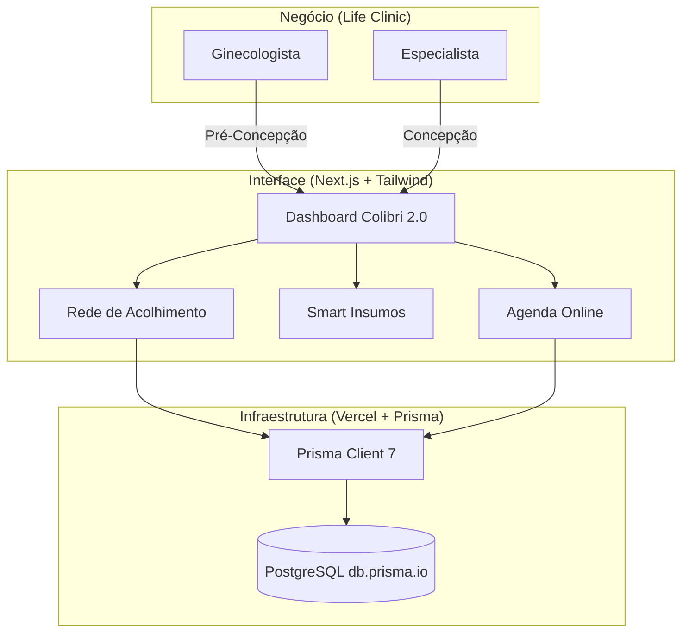

# Arquitetura da Solução - Colibri 2.0

## Objetivo
Integrar a jornada de reprodução humana em uma plataforma única, conectando pacientes a uma rede de acolhimento especializada e oferecendo ferramentas de gestão inteligente.

## Tecnologias
- **Frontend/Backend:** Next.js 15+ (App Router)
- **ORM:** Prisma 7
- **Banco de Dados:** PostgreSQL
- **Infraestrutura:** Vercel

## Fluxo da Jornada (POC)

